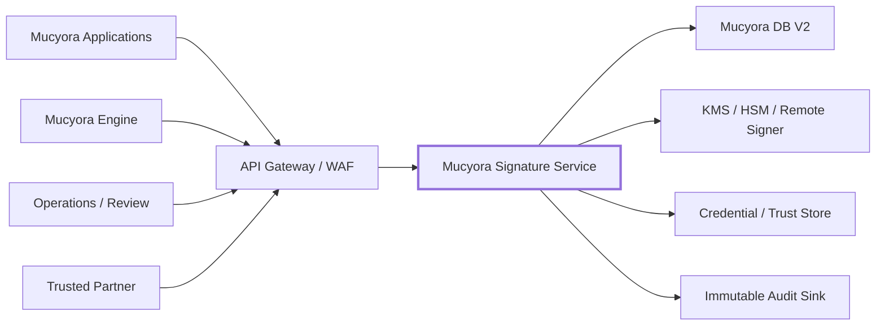
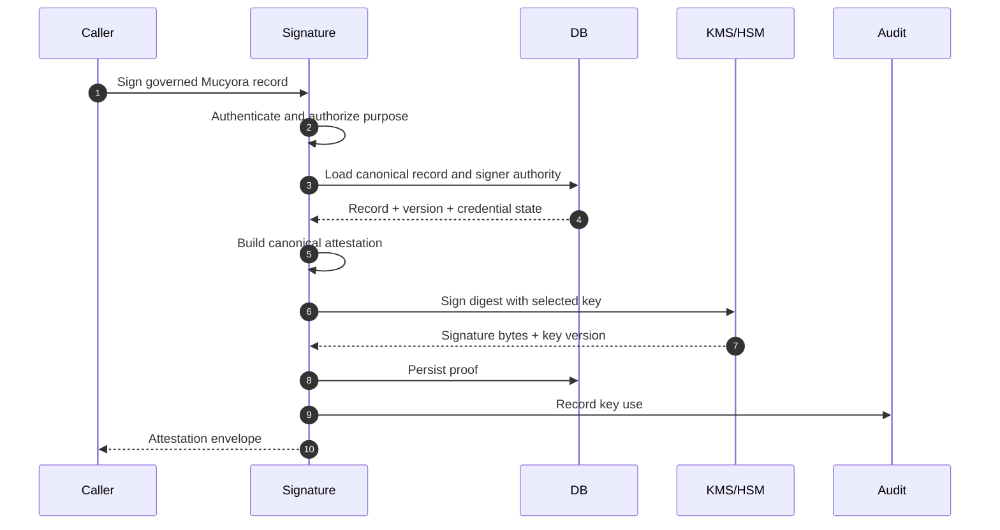
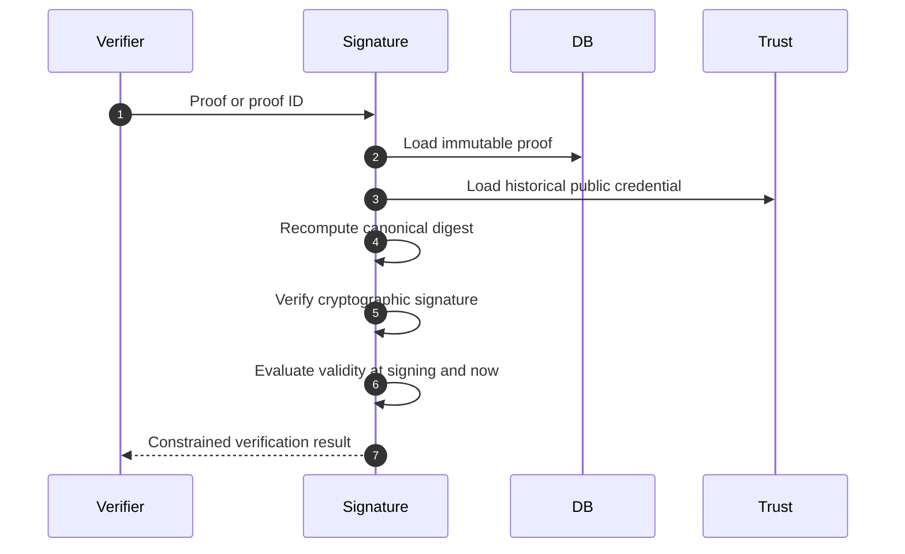
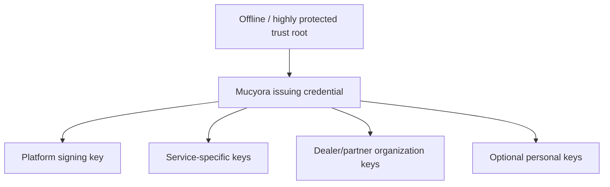
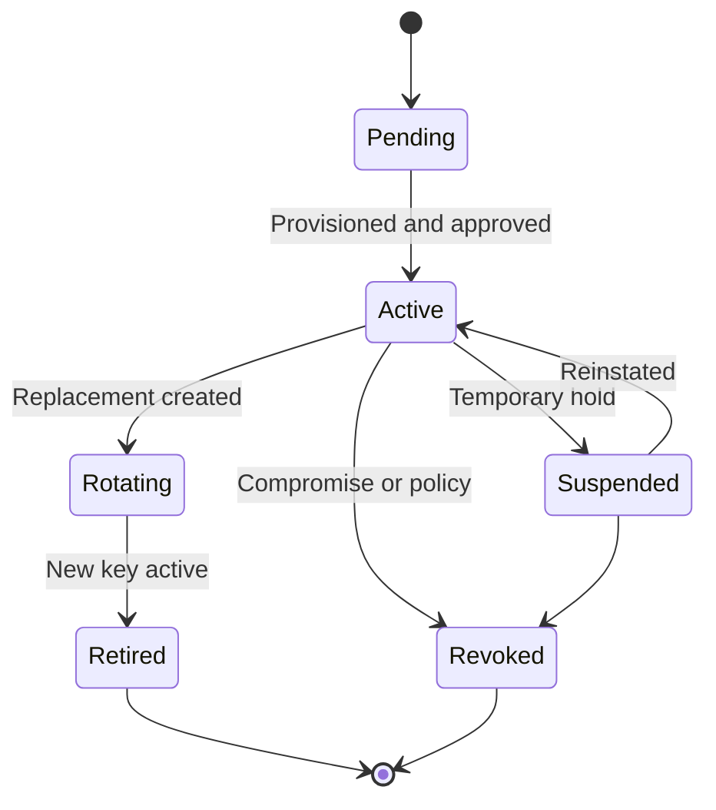
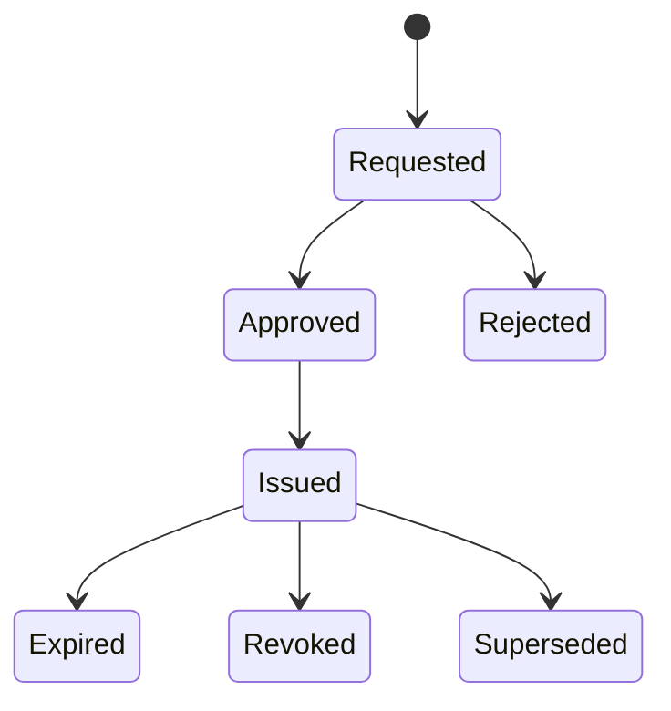
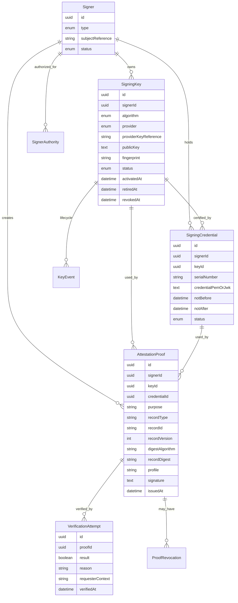
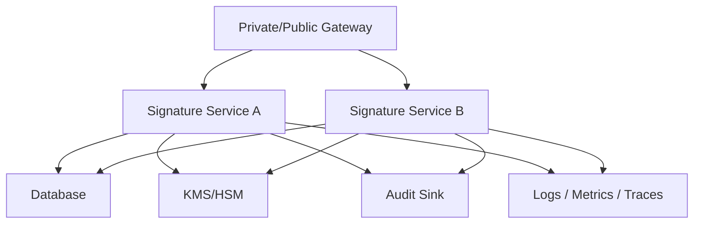

<div align="center">

# Mucyora Signature Service

### Cryptographic attestations, signer authority, key governance, and verifiable provenance proofs for the Mucyora platform

[](#overview)
[](#service-responsibilities)
[](#security-model)
[](#repository-access-note)

**Mucyora Signature Service** is the proposed cryptographic trust service for Mucyora. It should create and verify digital attestations over device-provenance records, ownership transfers, incident reports, dealer transactions, administrative decisions, and other immutable platform evidence without exposing private signing keys.

[Overview](#overview) ·
[Architecture](#architecture) ·
[Trust model](#trust-model) ·
[Signing](#signing-workflows) ·
[Verification](#verification-workflows) ·
[API](#api-contract) ·
[Setup](#local-development) ·
[Security](#security-model)

</div>

---

> [!WARNING]
> **Source reconciliation required:** the repository could not be retrieved through public GitHub or raw-file access during this documentation pass. Product, trust-model, and security sections are designed for the Mucyora ecosystem, while the exact framework, dependencies, routes, algorithms, database models, key storage, environment variables, tests, CI, and license must be reconciled against the actual source before this file is committed as implementation documentation.

> [!IMPORTANT]
> A digital signature proves that a specific key signed specific bytes. It does not by itself prove lawful ownership, identity quality, or the correctness of the underlying Mucyora record. The signed payload must bind the signer, authority, subject, purpose, timestamps, policy version, and exact record digest.

> [!CAUTION]
> Production private keys should not be returned to application clients or stored as recoverable plaintext. Prefer HSM, KMS, or a remote signing boundary for platform, institutional, dealer, and high-trust personal keys.

---

## Table of contents

- [Repository access note](#repository-access-note)
- [Overview](#overview)
- [Why this service exists](#why-this-service-exists)
- [Current documentation status](#current-documentation-status)
- [Service responsibilities](#service-responsibilities)
- [What this service must not own](#what-this-service-must-not-own)
- [Architecture](#architecture)
- [Trust boundaries](#trust-boundaries)
- [Technology stack](#technology-stack)
- [Project structure](#project-structure)
- [Trust model](#trust-model)
- [Signer types](#signer-types)
- [Key hierarchy](#key-hierarchy)
- [Key lifecycle](#key-lifecycle)
- [Certificate and credential lifecycle](#certificate-and-credential-lifecycle)
- [Attestation profile](#attestation-profile)
- [Canonical payloads](#canonical-payloads)
- [Signing workflows](#signing-workflows)
- [Verification workflows](#verification-workflows)
- [Device-check attestations](#device-check-attestations)
- [Ownership-transfer attestations](#ownership-transfer-attestations)
- [Incident attestations](#incident-attestations)
- [Dealer-transaction attestations](#dealer-transaction-attestations)
- [Administrative attestations](#administrative-attestations)
- [Public verification](#public-verification)
- [Revocation and trust status](#revocation-and-trust-status)
- [Timestamping and replay protection](#timestamping-and-replay-protection)
- [Data model](#data-model)
- [API contract](#api-contract)
- [Request examples](#request-examples)
- [Authentication and authorization](#authentication-and-authorization)
- [Configuration](#configuration)
- [Database ownership](#database-ownership)
- [Local development](#local-development)
- [API documentation](#api-documentation)
- [Testing and quality](#testing-and-quality)
- [Deployment](#deployment)
- [Operations and observability](#operations-and-observability)
- [Security model](#security-model)
- [Privacy and retention](#privacy-and-retention)
- [Known design risks](#known-design-risks)
- [Implementation reconciliation checklist](#implementation-reconciliation-checklist)
- [Production-hardening roadmap](#production-hardening-roadmap)
- [Troubleshooting](#troubleshooting)
- [Contributing](#contributing)
- [License](#license)

---

## Repository access note

The supplied repository URL was not publicly retrievable during this documentation pass.

This README deliberately avoids claiming unverified details such as:

- whether the service uses NestJS, another Node.js framework, Python, Go, or another runtime;
- exact package versions;
- exact HTTP routes;
- exact request and response DTOs;
- exact signing algorithms;
- whether keys are software-held, KMS-held, or HSM-held;
- whether certificates are self-signed, platform-issued, or externally issued;
- whether the service stores visual signature images;
- exact database models;
- environment-variable names;
- CI/CD behavior;
- license status.

Before committing this file:

1. inspect the repository root;
2. identify the runtime and framework;
3. inspect the dependency manifest;
4. enumerate controllers/routes;
5. inspect authentication and authorization;
6. inspect key-generation and signing code;
7. inspect verification and revocation logic;
8. inspect database models;
9. inspect configuration and secrets;
10. inspect tests and CI;
11. replace proposed contracts with actual behavior;
12. remove this note after reconciliation.

---

## Overview

Mucyora’s core product is a cloud ledger for device provenance and ownership assurance. A signature service strengthens that ledger by allowing important records to be cryptographically attested and independently verified.

The service should support evidence such as:

- a device-check result;
- an ownership claim approval;
- an ownership transfer completion;
- a lost or stolen report;
- a recovery decision;
- a dealer intake or resale transaction;
- a reviewer decision;
- a platform-issued receipt;
- an external partner attestation.

A signature should bind the exact record—not a loose screenshot or mutable display page.

### Core questions

The service should answer:

1. Which key signed the record?
2. Who or what controlled that key?
3. What exact bytes were signed?
4. What purpose was authorized?
5. Was the credential valid at signing time?
6. Is it revoked now?
7. Was the signed record changed?
8. Which Mucyora record does the proof refer to?
9. Which signing policy and algorithm were used?
10. Can a verifier evaluate the proof without private data leakage?

---

## Why this service exists

Without a formal signature profile, different services can sign:

- different JSON field order;
- different hashes;
- different timestamp formats;
- ambiguous record identifiers;
- incomplete authority context;
- mutable payloads;
- incompatible algorithms.

A dedicated service provides one governed contract for:

- canonicalization;
- key use;
- signer authority;
- certificate/credential status;
- signing;
- verification;
- revocation;
- audit;
- public proof serialization.

---

## Current documentation status

| Area | Status |
|---|---|
| Mucyora product purpose | Confirmed publicly |
| Repository availability | Not publicly retrievable during this pass |
| Runtime/framework | `TBD_FROM_SOURCE` |
| Signing algorithms | `TBD_FROM_SOURCE` |
| Key provider | `TBD_FROM_SOURCE` |
| Credential model | `TBD_FROM_SOURCE` |
| Database integration | `TBD_FROM_SOURCE` |
| Routes and DTOs | `TBD_FROM_SOURCE` |
| Tests and CI | `TBD_FROM_SOURCE` |
| License | `TBD_FROM_SOURCE` |
| Proposed trust architecture | Documented below |

---

## Service responsibilities

The service should own or coordinate:

- signer registration;
- key generation or remote-key provisioning;
- public-key metadata;
- key fingerprints;
- key activation, rotation, suspension, and revocation;
- signing credentials and certificates;
- signer-purpose authorization;
- canonical attestation payloads;
- digest generation;
- cryptographic signing;
- signature verification;
- historical proof lookup;
- trust status;
- revocation status;
- timestamp and replay controls;
- audit events;
- public verification responses;
- service-to-service signing APIs;
- metrics and operational controls.

Depending on actual source, it may also own:

- user signature images;
- certificate requests;
- administrator approval;
- CSR generation;
- CA integration;
- KMS/HSM integration;
- document signing;
- PDF signatures;
- JWS, COSE, or CMS envelopes.

Confirm every responsibility against source.

---

## What this service must not own

The service should not:

- determine lawful device ownership;
- decide whether a device is stolen;
- replace the Mucyora Engine’s risk rules;
- own the canonical device ledger;
- expose private keys;
- trust caller-supplied authority without verification;
- sign arbitrary unbounded payloads;
- act as a public CA unless explicitly governed;
- store mutable document content without a clear boundary;
- accept frontend-only authorization;
- return private owner information through verification.

Recommended ownership:

| Concern | Owner |
|---|---|
| Device and ownership truth | Mucyora DB V2 / Engine |
| Risk decision | Mucyora Engine |
| Identity/session | Auth/Identity service |
| Signing operation | Signature Service |
| Key custody | KMS/HSM or approved key provider |
| Evidence objects | Private object storage |
| Notifications | Notification service |
| Public verification UI | Web/mobile application |

---

## Architecture



### Signing sequence



### Verification sequence



---

## Trust boundaries

| Boundary | Required enforcement |
|---|---|
| Public verifier vs. internal proof | Constrained public serializer |
| User vs. signer identity | Trusted identity binding |
| Signer vs. signing purpose | Explicit authorization policy |
| Caller payload vs. canonical record | Server-side record loading and canonicalization |
| Application vs. private key | Remote key operation |
| Current credential vs. historical proof | Credential ID/version persisted |
| Revoked key vs. old signature | Separate “valid at signing” and “current trust” |
| Engine vs. Signature Service | Service authentication and scoped operation |
| Signature Service vs. DB | Least privilege |
| Signature Service vs. KMS/HSM | Key policy and authenticated channel |
| Retry vs. duplicate proof | Idempotency |

---

## Technology stack

Replace after source inspection.

| Layer | Actual value |
|---|---|
| Runtime | `TBD_FROM_SOURCE` |
| Framework | `TBD_FROM_SOURCE` |
| Language | `TBD_FROM_SOURCE` |
| Database client | `TBD_FROM_SOURCE` |
| Signing library | `TBD_FROM_SOURCE` |
| Key provider | `TBD_FROM_SOURCE` |
| Certificate library | `TBD_FROM_SOURCE` |
| API documentation | `TBD_FROM_SOURCE` |
| Testing | `TBD_FROM_SOURCE` |
| CI/CD | `TBD_FROM_SOURCE` |

---

## Project structure

Replace with the actual tree.

```text
mucyora-signature-service/
├── src/
│   ├── auth/
│   ├── signers/
│   ├── keys/
│   ├── credentials/
│   ├── attestations/
│   ├── signing/
│   ├── verification/
│   ├── revocation/
│   ├── audit/
│   ├── config/
│   └── common/
├── tests/
├── docs/
├── scripts/
├── .env.example
├── Dockerfile
├── dependency manifest
└── README.md
```

Recommended module boundaries:

- `signers` — signer identity and approved purposes;
- `keys` — key metadata and provider references;
- `credentials` — certificates and trust status;
- `attestations` — canonical payload profiles;
- `signing` — governed key use;
- `verification` — historical proof verification;
- `revocation` — key/credential status;
- `audit` — append-only security events.

---

## Trust model

The service should distinguish:

### Identity trust

Who is the signer?

Examples:

- Mucyora platform;
- verified device owner;
- dealer;
- reviewer;
- administrator;
- telecom;
- insurer;
- law-enforcement partner.

### Authority trust

What may the signer attest?

Examples:

- owner may accept an ownership transfer;
- dealer may attest a physical intake inspection;
- reviewer may approve a recovery case;
- Mucyora platform may attest a device-check decision;
- external authority may attest a case reference.

### Key trust

Which key is permitted?

- active;
- not suspended;
- approved algorithm;
- correct purpose;
- stored in approved provider;
- credential valid.

### Record trust

Which canonical Mucyora record is signed?

The proof must bind:

- record type;
- record ID;
- record version;
- subject device ID;
- digest;
- purpose;
- signer;
- time;
- policy version.

---

## Signer types

Recommended signer types:

```text
MUCYORA_PLATFORM
DEVICE_OWNER
DEALER_ORGANIZATION
DEALER_EMPLOYEE
REVIEWER
ADMINISTRATOR
TELECOM_PARTNER
INSURER_PARTNER
LAW_ENFORCEMENT_PARTNER
SERVICE_IDENTITY
```

Each signer type should have an explicit purpose matrix.

---

## Key hierarchy

Recommended hierarchy:



A simpler system may use KMS-backed public keys without X.509. Document the actual design.

### Key separation

Do not use one key for:

- access tokens;
- attestation signing;
- encryption;
- webhook signing;
- partner authentication.

---

## Key lifecycle



Persist:

- key ID;
- signer ID;
- algorithm;
- provider;
- provider key reference;
- public key;
- fingerprint;
- purpose;
- status;
- activation;
- retirement;
- revocation;
- reason;
- created/approved actor.

---

## Certificate and credential lifecycle

If certificates are used:



A certificate should bind:

- public key;
- signer identity;
- approved purpose;
- policy;
- validity;
- issuer;
- serial number.

### Historical verification

Always store the exact credential ID used at signing.

Do not verify historical proofs using only the signer’s latest active credential.

---

## Attestation profile

A recommended envelope:

```json
{
  "profile": "mucyora-attestation/v1",
  "proofId": "prf_example",
  "purpose": "DEVICE_CHECK_DECISION",
  "record": {
    "type": "DEVICE_CHECK",
    "id": "check_example",
    "version": 3,
    "digestAlgorithm": "SHA-256",
    "digest": "hex-or-base64-digest"
  },
  "subject": {
    "deviceId": "device_example",
    "maskedIdentifier": "***********1234"
  },
  "signer": {
    "type": "MUCYORA_PLATFORM",
    "id": "signer_example",
    "credentialId": "credential_example",
    "keyId": "key_example"
  },
  "policy": {
    "ruleVersion": "device-check/v4",
    "signatureProfile": "mucyora-attestation/v1"
  },
  "issuedAt": "2026-07-29T15:00:00.000Z",
  "expiresAt": null,
  "nonce": "base64url-random-value",
  "signatureAlgorithm": "EdDSA",
  "signature": "base64url-signature"
}
```

Do not include private owner data in a public proof.

---

## Canonical payloads

Never sign arbitrary JSON serialization without a canonicalization rule.

Options:

- JSON Canonicalization Scheme;
- deterministic CBOR/COSE;
- JWS with a defined payload;
- protobuf deterministic serialization;
- CMS for document-oriented workflows.

A canonical payload should define:

- field order;
- string normalization;
- date format;
- number representation;
- absent/null behavior;
- digest encoding;
- schema version.

### Server-side source

For authoritative records, the service should load the record by ID rather than trusting a caller-provided record body.

---

## Signing workflows

### Governed signing

1. authenticate caller;
2. authorize signing purpose;
3. load canonical record;
4. validate record state;
5. load signer authority;
6. select exact key/credential;
7. build canonical payload;
8. compute digest;
9. call key provider;
10. persist proof;
11. write audit event;
12. return envelope.

### Idempotency

A repeated request with the same idempotency key and same payload should return the same proof.

---

## Verification workflows

A robust verifier should distinguish:

```text
cryptographic signature valid?
credential valid at signing time?
credential trusted now?
record digest matches?
proof purpose valid?
proof revoked?
source record still exists?
```

Recommended response:

```json
{
  "valid": true,
  "cryptographicSignatureValid": true,
  "recordDigestMatches": true,
  "credentialValidAtSigning": true,
  "credentialStatusNow": "REVOKED_AFTER_SIGNING",
  "proofStatus": "ACTIVE",
  "purpose": "OWNERSHIP_TRANSFER_COMPLETION",
  "issuedAt": "2026-07-29T15:00:00.000Z"
}
```

Do not collapse all states into a single boolean.

---

## Device-check attestations

Bind:

- device-check ID;
- device ID;
- masked identifier;
- decision;
- reason codes;
- source freshness;
- rule version;
- checked-at time.

Do not expose owner identity or private source payloads.

---

## Ownership-transfer attestations

A completed transfer proof should bind:

- transfer ID;
- device ID;
- previous ownership record ID;
- new ownership record ID;
- seller signer or authorization;
- buyer signer or authorization;
- completion time;
- incident-check result;
- transaction version.

A platform signature can attest the completed state even when buyers and sellers do not possess personal cryptographic keys.

---

## Incident attestations

Bind:

- incident ID;
- device ID;
- type;
- status;
- activation/recovery time;
- source authority;
- review ID;
- policy version.

Public verification should not expose police report contents.

---

## Dealer-transaction attestations

Bind:

- dealer organization;
- employee or service signer;
- device ID;
- device-check proof ID;
- transaction reference;
- ownership-transfer proof ID;
- timestamp.

Use organization-scoped keys where possible.

---

## Administrative attestations

High-impact administrative proof includes:

- action;
- record before/after digest;
- reason;
- reviewer;
- approver;
- case/reference;
- timestamp.

Exceptional overrides should use dual approval.

---

## Public verification

A public endpoint should accept:

- proof ID; or
- complete portable envelope.

It should return:

- verification status;
- purpose;
- issued time;
- constrained signer identity;
- record type;
- masked device identifier;
- current revocation/trust status;
- safe reason.

It should not return:

- private key metadata;
- full IMEI;
- owner identity;
- private evidence;
- internal reviewer notes.

---

## Revocation and trust status

Revocation targets may include:

- key;
- credential;
- proof;
- signer authority;
- partner organization.

Store:

- target;
- reason;
- effective time;
- actor;
- case/reference.

### Historical semantics

If a key is revoked after a valid signature, report:

```text
signature was valid at signing time
credential is revoked now
```

Do not rewrite history.

---

## Timestamping and replay protection

### Timestamp

Use trusted server time.

For higher assurance, integrate:

- RFC 3161 timestamp authority;
- transparency log;
- append-only ledger;
- external notarization.

### Replay

Include:

- nonce;
- purpose;
- record ID/version;
- issued-at;
- idempotency key.

A valid old proof should not authorize a new operation unless the receiving workflow explicitly permits it.

---

## Data model



Conceptual only. Replace with actual models.

---

## API contract

The following is proposed.

Base:

```text
/api/v1
```

### Health

| Method | Path | Access | Purpose |
|---|---|---|---|
| `GET` | `/health` | Internal/constrained | Liveness |
| `GET` | `/ready` | Internal | DB and key-provider readiness |

### Signers and keys

| Method | Path | Access | Purpose |
|---|---|---|---|
| `POST` | `/signers` | Admin/internal | Register signer |
| `POST` | `/signers/:id/keys` | Admin/internal | Provision key |
| `GET` | `/signers/:id/keys` | Admin/internal | List keys |
| `POST` | `/keys/:id/rotate` | Admin/internal | Rotate |
| `POST` | `/keys/:id/revoke` | Admin/internal | Revoke |

### Attestations

| Method | Path | Access | Purpose |
|---|---|---|---|
| `POST` | `/attestations/device-checks/:id` | Engine/internal | Sign device-check record |
| `POST` | `/attestations/transfers/:id` | Engine/internal | Sign completed transfer |
| `POST` | `/attestations/incidents/:id` | Engine/internal | Sign incident state |
| `POST` | `/attestations/dealer-transactions/:id` | Dealer/internal | Sign dealer transaction |
| `GET` | `/attestations/:id` | Authorized/public constrained | Retrieve proof |

### Verification

| Method | Path | Access | Purpose |
|---|---|---|---|
| `POST` | `/verify` | Public rate-limited | Verify portable proof |
| `GET` | `/verify/:proofId` | Public rate-limited | Verify stored proof |
| `POST` | `/attestations/:id/revoke` | Admin/internal | Revoke proof |

---

## Request examples

### Sign device-check result

```bash
curl --request POST \
  --url "http://localhost:3005/api/v1/attestations/device-checks/<check-id>" \
  --header "Authorization: Bearer <service-token>" \
  --header "Idempotency-Key: device-check-proof-<check-id>"
```

### Verify proof

```bash
curl --request GET \
  --url "http://localhost:3005/api/v1/verify/<proof-id>"
```

### Verify portable envelope

```bash
curl --request POST \
  --url "http://localhost:3005/api/v1/verify" \
  --header "Content-Type: application/json" \
  --data @attestation.json
```

Replace port, routes, and auth with actual source.

---

## Authentication and authorization

Recommended identities:

- Mucyora Engine service;
- operations admin;
- reviewer;
- dealer organization service;
- partner service;
- public verifier.

### Internal signing

Use:

- mTLS;
- service JWT with issuer/audience/scope;
- workload identity;
- private network.

Avoid one shared static API key for all services.

### Purpose scope

Example:

```text
attestations:device-check:create
attestations:transfer:create
attestations:incident:create
proofs:verify
keys:rotate
keys:revoke
```

---

## Configuration

Replace with actual `.env.example`.

```dotenv
APP_ENV=development
APP_PORT=3005

DATABASE_URL=

SERVICE_JWT_ISSUER=
SERVICE_JWT_AUDIENCE=
SERVICE_JWT_PUBLIC_KEY=

KEY_PROVIDER=KMS
KMS_KEY_REGION=
KMS_KEY_ALIAS=

SIGNATURE_PROFILE=mucyora-attestation/v1
DEFAULT_SIGNATURE_ALGORITHM=EdDSA
ALLOWED_CLOCK_SKEW_SECONDS=60

PUBLIC_VERIFICATION_URL=
AUDIT_SINK_URL=
```

Never commit real credentials.

---

## Database ownership

Mucyora DB V2 should own schema and migrations.

This service should consume approved models/client and should not create a separate competing migration history unless the architecture explicitly assigns it an independent database.

Recommended data domains:

- signer;
- key metadata;
- credentials;
- attestations;
- verification attempts;
- revocations;
- audit/outbox.

---

## Local development

Replace with actual runtime.

```bash
git clone https://github.com/kajugadaniels/mucyora-signature-service.git
cd mucyora-signature-service
cp .env.example .env
```

Node example:

```bash
npm install
npm run start:dev
```

Python example:

```bash
python -m venv .venv
source .venv/bin/activate
pip install -r requirements.txt
```

Delete non-applicable examples.

### Local keys

Use:

- local KMS emulator;
- SoftHSM;
- generated development-only keys;
- isolated test keys.

Never use production key material locally.

---

## API documentation

Document the actual path after source inspection.

OpenAPI should describe:

- authentication;
- scopes;
- signing purpose;
- supported algorithms;
- canonical profile;
- verification states;
- revocation semantics;
- rate limits;
- error codes.

---

## Testing and quality

### Cryptographic tests

- known-answer signing and verification;
- changed payload fails;
- changed purpose fails;
- wrong key fails;
- expired credential reporting;
- revoked-after-signing reporting;
- algorithm confusion rejection;
- malformed signature;
- canonicalization stability.

### Authorization tests

- wrong service scope;
- caller signs unsupported record;
- dealer crosses organization;
- public caller accesses key metadata;
- reviewer rotates key.

### Lifecycle tests

- key rotation;
- credential expiry;
- proof revocation;
- signer suspension;
- idempotent signing;
- concurrent signing.

### Integration tests

- KMS/HSM failure;
- DB failure after signing;
- audit failure;
- timeout;
- restore and historical verification.

---

## Deployment

Recommended topology:



### Checklist

- [ ] Source reconciliation complete
- [ ] KMS/HSM configured
- [ ] No private key in application DB
- [ ] Service authentication configured
- [ ] Public verification rate-limited
- [ ] CORS restricted
- [ ] DB runtime role least-privilege
- [ ] Audit durable
- [ ] Health/readiness present
- [ ] Key rotation tested
- [ ] Restore verification tested
- [ ] Algorithms allowlisted
- [ ] Clock synchronized
- [ ] Secrets in manager
- [ ] Threat model reviewed

---

## Operations and observability

Metrics:

- signatures by purpose;
- verification success/failure;
- KMS latency;
- signing failures;
- key status;
- credential expiry;
- revocation;
- duplicate/idempotent requests;
- audit failure;
- public verification volume;
- authorization denial.

Alerts:

- signing with suspended signer attempt;
- unexpected key use;
- KMS auth failure;
- verification failure spike;
- clock drift;
- audit failure;
- key approaching expiry;
- proof issuance spike;
- 401/403/429/5xx spike.

---

## Security model

Implemented controls must be populated from source.

Required controls:

- auth by default;
- purpose-scoped authorization;
- canonical payload;
- algorithm allowlist;
- key-provider isolation;
- no key export;
- historical credential binding;
- revocation;
- idempotency;
- audit;
- field minimization;
- rate limiting;
- secure configuration;
- dependency scanning.

See `SECURITY.md` for the complete policy.

---

## Privacy and retention

Proofs should avoid unnecessary personal data.

Prefer references and masked identifiers.

Retention classes:

| Record | Consideration |
|---|---|
| Key metadata | Long-lived |
| Credential | Long-lived for historical verification |
| Proof | Long-lived provenance |
| Verification attempt | Abuse/investigation window |
| Audit | Long-lived |
| Public verification cache | Short |
| Revocation | Permanent/historical |

Do not delete historical public keys needed to verify old proofs.

---

## Known design risks

1. Repository implementation is unverified.
2. Signing caller-provided arbitrary JSON can create ambiguity.
3. Historical verification can fail if latest credential is used instead of original.
4. Algorithm confusion can occur without explicit allowlists.
5. Self-signed certificates may imply more trust than they provide.
6. Software-held private keys expose process memory.
7. Signing can succeed before proof persistence.
8. Duplicate requests can create multiple proofs.
9. Current revocation can be confused with validity at signing time.
10. Public proof can leak private ownership details.
11. One shared key can make attribution weak.
12. Static service credentials can be abused.
13. Clock drift can invalidate policy.
14. Key rotation without compatibility testing can break verification.
15. Audit failure can hide key use.

---

## Implementation reconciliation checklist

### Repository

- [ ] runtime/framework
- [ ] package versions
- [ ] project tree
- [ ] license

### Cryptography

- [ ] algorithms
- [ ] signing input
- [ ] canonicalization
- [ ] key provider
- [ ] private-key format
- [ ] certificate model
- [ ] revocation
- [ ] historical verification

### API

- [ ] routes
- [ ] DTOs
- [ ] auth
- [ ] scopes
- [ ] rate limits
- [ ] errors
- [ ] OpenAPI

### Data and operations

- [ ] models
- [ ] migrations owner
- [ ] idempotency
- [ ] audit
- [ ] health/readiness
- [ ] CI/CD
- [ ] tests
- [ ] monitoring

---

## Production-hardening roadmap

### Priority 0

- [ ] Reconcile source
- [ ] Define canonical profile
- [ ] Restrict algorithms
- [ ] Persist key/credential IDs
- [ ] Make verification historical-proof-centric
- [ ] Add idempotency
- [ ] Add durable audit
- [ ] Add readiness

### Priority 1

- [ ] KMS/HSM signing
- [ ] Service JWT or mTLS
- [ ] Key rotation workflow
- [ ] Credential revocation
- [ ] Proof revocation
- [ ] Public minimization
- [ ] Security tests

### Priority 2

- [ ] Timestamp authority/transparency log
- [ ] Dual-control administrative actions
- [ ] Signed build artifacts
- [ ] HSM disaster recovery
- [ ] SIEM integration
- [ ] formal cryptographic review

---

## Troubleshooting

### Repository cannot be accessed

Confirm repository visibility and GitHub permissions.

### Signature verifies locally but not through service

Check:

- canonicalization;
- digest encoding;
- algorithm;
- credential ID;
- payload version;
- Base64/Base64url.

### Historical proof fails after key rotation

Verification must use the key and credential captured on the proof.

### KMS reports permission denied

Check workload identity and key policy.

### Duplicate proofs appear

Add idempotency and a unique operation/reference constraint.

### Verification returns valid but record changed

Verification must recompute the canonical record digest or explicitly verify a portable immutable payload.

### Public response leaks owner information

Use a constrained public serializer.

---

## Contributing

1. Inspect repository guidance.
2. Preserve key isolation.
3. Define signing purpose.
4. Version canonical payloads.
5. Add known-answer tests.
6. Add authorization tests.
7. Add rotation/revocation tests.
8. Update OpenAPI.
9. Update README and SECURITY.

### Pull-request checklist

- [ ] No private key exposed
- [ ] Purpose authorization explicit
- [ ] Algorithm allowlisted
- [ ] Canonicalization deterministic
- [ ] Credential ID persisted
- [ ] Historical verification tested
- [ ] Revocation semantics documented
- [ ] Idempotency tested
- [ ] Audit written
- [ ] Public data minimized
- [ ] Source documentation updated

---

## License

The repository license could not be confirmed.

Do not assume open-source redistribution rights until the actual license is inspected.

---

<div align="center">

Built for **Mucyora** — making device-provenance records portable, tamper-evident, attributable, and independently verifiable.

</div>
