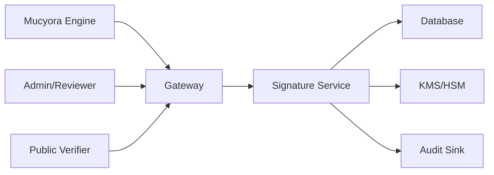

<div align="center">

# Mucyora Signature Service Security

### Cryptographic security policy, key-custody requirements, trust governance, incident response, and verification integrity

[](#scope)
[](#private-key-custody)
[](#authorization-and-signing-purpose)
[](#source-reconciliation-status)

</div>

---

> [!WARNING]
> **Source reconciliation required:** this policy is a Mucyora-specific security baseline, not an attestation that every control is implemented. The repository was not publicly retrievable during the documentation pass. Reconcile framework, routes, key algorithms, key custody, credential model, database behavior, environment variables, CI, and tests before production use.

> [!IMPORTANT]
> The most important boundary is the private key. Application code should request a signing operation from an approved key provider; it should not retrieve or return raw production private keys.

> [!CAUTION]
> Signature validity, signer identity, authority, credential status, and record correctness are separate questions. Verification responses must not merge them into a misleading single boolean without explanatory fields.

---

## Table of contents

- [Scope](#scope)
- [Source reconciliation status](#source-reconciliation-status)
- [Security objectives](#security-objectives)
- [Security principles](#security-principles)
- [Protected assets](#protected-assets)
- [Data classification](#data-classification)
- [Trust boundaries](#trust-boundaries)
- [Threat actors](#threat-actors)
- [Attack surface](#attack-surface)
- [Authentication](#authentication)
- [Authorization and signing purpose](#authorization-and-signing-purpose)
- [Service-to-service authentication](#service-to-service-authentication)
- [Private-key custody](#private-key-custody)
- [Key hierarchy and separation](#key-hierarchy-and-separation)
- [Key generation](#key-generation)
- [Key activation and approval](#key-activation-and-approval)
- [Key rotation](#key-rotation)
- [Key suspension and revocation](#key-suspension-and-revocation)
- [Key backup and recovery](#key-backup-and-recovery)
- [Certificate and credential security](#certificate-and-credential-security)
- [Algorithm policy](#algorithm-policy)
- [Canonicalization](#canonicalization)
- [Digest and signing profile](#digest-and-signing-profile)
- [Attestation integrity](#attestation-integrity)
- [Historical verification](#historical-verification)
- [Revocation semantics](#revocation-semantics)
- [Timestamp and clock security](#timestamp-and-clock-security)
- [Replay prevention and idempotency](#replay-prevention-and-idempotency)
- [Public verification security](#public-verification-security)
- [API security](#api-security)
- [Input validation](#input-validation)
- [Rate limiting and abuse controls](#rate-limiting-and-abuse-controls)
- [Error handling](#error-handling)
- [Database security](#database-security)
- [Secrets and configuration](#secrets-and-configuration)
- [Logging and audit](#logging-and-audit)
- [Privacy and minimization](#privacy-and-minimization)
- [Availability and resilience](#availability-and-resilience)
- [KMS and HSM integration](#kms-and-hsm-integration)
- [Background jobs and webhooks](#background-jobs-and-webhooks)
- [Dependency and supply-chain security](#dependency-and-supply-chain-security)
- [CI/CD security](#cicd-security)
- [Container and runtime hardening](#container-and-runtime-hardening)
- [Environment separation](#environment-separation)
- [Security testing](#security-testing)
- [Threat scenarios](#threat-scenarios)
- [Incident response](#incident-response)
- [Monitoring and alerting](#monitoring-and-alerting)
- [Vulnerability reporting](#vulnerability-reporting)
- [Security review checklist](#security-review-checklist)
- [Source reconciliation checklist](#source-reconciliation-checklist)
- [Production-hardening roadmap](#production-hardening-roadmap)
- [Document maintenance](#document-maintenance)

---

## Scope

This policy applies to:

- signing APIs;
- verification APIs;
- signer registration;
- signing-purpose policy;
- key metadata;
- key providers;
- certificates/credentials;
- proof storage;
- revocation;
- audit;
- service authentication;
- public verification;
- production operations.

It also establishes requirements for trusted callers such as Mucyora Engine, dealer services, and administrative workflows.

---

## Source reconciliation status

| Area | Status |
|---|---|
| Runtime/framework | `TBD_FROM_SOURCE` |
| Authentication | `TBD_FROM_SOURCE` |
| Key provider | `TBD_FROM_SOURCE` |
| Algorithms | `TBD_FROM_SOURCE` |
| Canonicalization | `TBD_FROM_SOURCE` |
| Credential/certificate model | `TBD_FROM_SOURCE` |
| Revocation | `TBD_FROM_SOURCE` |
| Database | `TBD_FROM_SOURCE` |
| Rate limiting | `TBD_FROM_SOURCE` |
| Audit | `TBD_FROM_SOURCE` |
| Tests/CI | `TBD_FROM_SOURCE` |
| Security contact | `TBD_FROM_SOURCE` |

Use:

- Implemented
- Partially implemented
- Planned
- Not applicable
- Unknown

when reconciling.

---

## Security objectives

### Confidentiality

Protect:

- private keys;
- KMS/HSM credentials;
- service credentials;
- signer identity details;
- private proof metadata;
- owner/device links;
- revocation investigations.

### Integrity

Protect:

- canonical payload;
- digest;
- signature;
- key ID;
- credential ID;
- signing purpose;
- timestamps;
- revocation state;
- audit events.

### Availability

Maintain:

- verification availability;
- safe signing failure;
- key-provider resilience;
- database durability;
- revocation distribution.

### Accountability

Attribute every key use to:

- caller;
- service identity;
- signer;
- purpose;
- record ID/version;
- request ID;
- key/credential;
- time.

---

## Security principles

- keys are non-exportable;
- signing is purpose-scoped;
- records are loaded server-side;
- payloads are canonical and versioned;
- algorithms are allowlisted;
- historical proofs bind exact key and credential;
- revocation is explicit;
- audit is durable;
- public data is minimized;
- failures are safe;
- high-impact operations use dual control.

---

## Protected assets

| Asset | Risk |
|---|---|
| Production private key | Forged platform proof |
| Root/issuer key | System-wide trust compromise |
| Key-provider policy | Unauthorized use |
| Public key/credential mapping | Misattribution |
| Canonicalization profile | Signature ambiguity |
| Signing-purpose rules | Abuse of legitimate key |
| Proof database | Evidence tampering |
| Revocation status | Acceptance of compromised key |
| Audit logs | Hidden abuse |
| Service credential | Unauthorized signatures |
| Clock source | Invalid timestamp policy |
| Build pipeline | Malicious signing code |

---

## Data classification

| Class | Examples |
|---|---|
| Public | Public key, public proof, constrained signer label |
| Internal | Key provider, algorithm policy, metrics |
| Confidential | Signer authority, proof metadata, verification attempts |
| Restricted | Device-owner relationship, admin reasons |
| Highly restricted | Private keys, root credentials, KMS admin credentials |

---

## Trust boundaries



Each path has different permissions.

---

## Threat actors

- external attacker;
- fraudulent dealer;
- compromised service caller;
- compromised administrator;
- insider with key-management access;
- compromised CI/CD;
- compromised KMS credential;
- malicious dependency;
- public verifier performing enumeration.

---

## Attack surface

- signing routes;
- verify routes;
- key-management routes;
- certificate routes;
- webhooks;
- KMS API;
- database;
- public proof URLs;
- CI/CD;
- logs;
- admin UI;
- backup/restore;
- clock/time service.

---

## Authentication

Protected routes require strong authenticated identity.

Validate:

- issuer;
- audience;
- expiration;
- subject;
- scope;
- token type;
- algorithm;
- signature.

Public verification can be anonymous but rate-limited and minimized.

Privileged staff should use MFA.

---

## Authorization and signing purpose

A valid caller is not automatically allowed to sign every record.

Policy dimensions:

```text
caller service
+ signer
+ purpose
+ record type
+ record state
+ organization scope
+ key purpose
```

Examples:

- Engine can request platform device-check proofs.
- Dealer service can request dealer-transaction proofs for its organization.
- Reviewer can approve a recovery attestation.
- Public verifier cannot create signatures.
- Admin cannot use a platform root for arbitrary content.

---

## Service-to-service authentication

Prefer:

- workload identity;
- mTLS;
- signed service JWT;
- private network.

Static Basic Auth or shared API keys should be treated as transitional.

Machine credentials require:

- scope;
- expiry;
- rotation;
- revocation;
- audit;
- separate environments.

---

## Private-key custody

### Production requirement

Private keys should be:

- generated in KMS/HSM;
- marked non-exportable;
- used through signing API;
- protected by key policy;
- monitored.

### Software-held keys

If temporarily used:

- encrypt with authenticated encryption;
- separate master key;
- version format;
- restrict memory and logs;
- rotate aggressively;
- document risk.

JavaScript/Python strings cannot guarantee zeroization.

---

## Key hierarchy and separation

Separate keys for:

- platform attestations;
- dealer organizations;
- partner organizations;
- service webhooks;
- JWTs;
- encryption;
- root/issuer.

Do not use an issuer/root key for routine online signing.

---

## Key generation

Require:

- approved algorithm;
- approved key size;
- secure random source;
- correct provider;
- signer and purpose;
- creator identity;
- approval;
- fingerprint.

Production root/issuer generation should use controlled ceremony.

---

## Key activation and approval

A key should not become active immediately after creation without policy.

Activation can require:

- verification of signer;
- key policy review;
- public-key validation;
- dual approval;
- certificate issuance;
- test signature.

---

## Key rotation

Rotation workflow:

1. create replacement;
2. validate;
3. issue credential;
4. activate new key;
5. switch signing;
6. retain old public key;
7. retire old key;
8. revoke only when required;
9. test historical verification.

Never delete old public material required for verification.

---

## Key suspension and revocation

### Suspension

Temporary block.

### Revocation

Permanent compromise/policy invalidation.

Store:

- reason;
- effective time;
- actor;
- case;
- affected proofs;
- notification status.

---

## Key backup and recovery

For KMS/HSM:

- use provider durability;
- multi-region/multi-zone where needed;
- documented disaster recovery;
- controlled replication.

For root keys:

- offline backup;
- split knowledge;
- tamper-evident storage;
- recovery ceremony.

Never put key backups in ordinary application backups.

---

## Certificate and credential security

If X.509:

- validate key usage;
- validate EKU/policy;
- validate chain;
- validate name/identifier;
- validate notBefore/notAfter;
- validate revocation;
- preserve issuer.

Do not put raw national IDs or private ownership data in publicly distributed certificates.

Self-signed credentials do not provide external CA trust.

---

## Algorithm policy

Explicit allowlist.

Recommended modern profiles may include:

- Ed25519/EdDSA;
- ECDSA P-256 with SHA-256;
- RSA-PSS SHA-256 with sufficient key size.

Policy depends on interoperability requirements.

Reject:

- `none`;
- caller-selected arbitrary algorithm;
- SHA-1;
- weak RSA;
- mismatched key/algorithm;
- algorithm substitution.

---

## Canonicalization

Canonicalization is security-critical.

Define:

- encoding;
- field order;
- null behavior;
- date format;
- Unicode;
- number format;
- schema version.

Use standardized formats where possible.

Tests must prove equivalent records produce identical bytes.

---

## Digest and signing profile

Avoid accidental double hashing.

Define precisely:

```text
canonical bytes
→ digest algorithm
→ signature primitive
→ output encoding
```

If API accepts a digest, verify:

- algorithm;
- length;
- provenance;
- purpose;
- record reference.

Prefer loading canonical records server-side.

---

## Attestation integrity

Proof binds:

- profile;
- purpose;
- record type/ID/version;
- digest;
- signer;
- key;
- credential;
- time;
- nonce;
- policy/rule version.

Do not sign a mutable URL alone.

---

## Historical verification

Historical verifier must use:

- stored proof;
- stored credential ID;
- stored key ID;
- policy active at signing.

Report separately:

- signature valid;
- credential valid at signing;
- credential current status;
- proof revoked;
- source record matches.

---

## Revocation semantics

Differentiate:

- key revoked;
- credential revoked;
- signer authority revoked;
- proof revoked;
- source record superseded.

A later revocation does not mathematically invalidate an old signature, but it changes trust interpretation.

---

## Timestamp and clock security

Use synchronized UTC.

Monitor drift.

For high-assurance proof, use trusted timestamp or transparency log.

Do not rely on caller timestamp.

---

## Replay prevention and idempotency

Signing requests require idempotency.

Store:

- caller;
- operation;
- record/version;
- request fingerprint;
- proof ID.

Reject same key with changed payload.

A proof must not be replayed as authorization for unrelated action.

---

## Public verification security

Controls:

- rate limit;
- no full IMEI;
- no owner identity;
- uniform not-found;
- no raw database errors;
- proof status and signer label only;
- optional CAPTCHA for high abuse.

Portable proof parsing must have body-size and nesting limits.

---

## API security

- TLS;
- auth by default;
- strict DTOs;
- body limits;
- secure headers;
- content-type validation;
- request IDs;
- timeouts;
- no debug errors.

Key-management endpoints should be private/internal.

---

## Input validation

Validate:

- UUIDs;
- record type;
- purpose;
- digest algorithm;
- digest length;
- Base64/Base64url;
- signature length;
- profile version;
- timestamp range;
- idempotency key.

Reject unknown fields for security-sensitive commands.

---

## Rate limiting and abuse controls

High-risk routes:

- public verify;
- sign;
- key provision;
- rotate;
- revoke;
- certificate issue.

Use distributed limits across replicas.

Alert on unusual signing volume.

---

## Error handling

Do not expose:

- key provider identifiers beyond approved;
- KMS policy;
- stack traces;
- DB queries;
- internal credential paths;
- whether a signer exists to unauthorized user.

Signing failures should not partially persist ambiguous proof state.

---

## Database security

Runtime role should access only signature tables and needed source-record views.

No migration credentials in app.

Protect proof and audit deletion.

Use transactions for proof persistence and outbox/audit state.

---

## Secrets and configuration

Secrets include:

- service JWT keys;
- KMS credentials;
- DB password;
- webhook secret;
- encryption key;
- CA key reference.

Use manager, rotate, and validate at startup.

No secrets in logs or Git.

---

## Logging and audit

Audit:

- signing request;
- signer/purpose;
- key ID;
- proof ID;
- caller;
- result;
- revocation;
- key lifecycle;
- credential lifecycle;
- public abuse.

Do not log signature payloads containing private data or raw tokens.

---

## Privacy and minimization

Public proofs should use:

- stable public signer label;
- record reference;
- masked identifier;
- status.

Avoid:

- owner identity;
- phone;
- national ID;
- police details;
- internal role hierarchy.

---

## Availability and resilience

Verification should remain available even if signing is paused.

Separate:

- signing path;
- verification path;
- key management path.

Use:

- timeout;
- retry;
- circuit breaker;
- queue;
- readiness;
- graceful shutdown.

---

## KMS and HSM integration

Controls:

- key policy restricts signer service;
- administrator cannot sign by default;
- application cannot administer key;
- cloud audit enabled;
- rotation policy;
- multi-region strategy;
- quota monitoring.

Verify returned key ID/version.

---

## Background jobs and webhooks

Jobs:

- credential expiry;
- revocation propagation;
- transparency publishing;
- audit export;
- key rotation.

Webhooks require signature, replay prevention, and idempotency.

---

## Dependency and supply-chain security

- lockfile;
- dependency audit;
- minimal crypto dependencies;
- primary/maintained libraries;
- signed releases where possible;
- SBOM;
- remove unused crypto packages.

Cryptographic code requires extra review.

---

## CI/CD security

- protected branch;
- two-person review for crypto/key changes;
- secret scanning;
- SAST;
- dependency scan;
- test vectors;
- environment approval;
- immutable artifact;
- no production KMS admin credentials in CI.

---

## Container and runtime hardening

- non-root;
- read-only filesystem;
- minimal image;
- restricted egress;
- no shell if unnecessary;
- resource limits;
- secrets mounted;
- production mode;
- debug off;
- time sync.

---

## Environment separation

Separate:

- keys;
- certificates;
- databases;
- service identities;
- audit;
- public URLs.

Never sign test records with production keys.

---

## Security testing

### Cryptographic

- known-answer;
- modified byte;
- wrong key;
- wrong algorithm;
- malformed DER/Base64;
- canonicalization;
- expired/revoked credential.

### Authorization

- wrong purpose;
- wrong organization;
- public key-management access;
- compromised caller scope.

### Lifecycle

- rotation;
- suspension;
- revocation;
- signer disable;
- historical verify.

### Resilience

- KMS timeout;
- DB failure after signature;
- duplicate request;
- audit failure;
- clock drift.

---

## Threat scenarios

### Compromised engine requests arbitrary signature

Mitigations:

- purpose scope;
- record loaded from DB;
- allowed record type;
- caller service policy;
- audit.

### KMS credential leaked

Mitigations:

- workload identity;
- key policy;
- restricted operation;
- alert;
- rapid revoke.

### Attacker changes proof key ID

Mitigation:

- key ID included in signed envelope and server-side proof.

### Key rotated and old proof fails

Mitigation:

- preserve public key and credential;
- verify by proof credential ID.

### Insider revokes proof to hide history

Mitigation:

- append-only revocation event;
- dual control;
- immutable audit.

### Public verify endpoint enumerates device records

Mitigation:

- random proof IDs;
- uniform response;
- rate limits;
- masked data.

---

## Incident response

### Private-key compromise

1. suspend key;
2. stop signing;
3. identify key-use history;
4. revoke credential/key;
5. activate replacement;
6. mark affected proof trust;
7. notify services/partners;
8. investigate root cause.

### Incorrect signatures

- freeze purpose/profile;
- identify by profile/rule version;
- preserve original proofs;
- issue corrected proofs where policy allows;
- communicate.

### KMS outage

- keep verification online;
- pause signing;
- queue only when replay-safe;
- alert;
- avoid software fallback with weaker custody.

### Database proof tampering

- compare audit/transparency copy;
- restrict writes;
- restore;
- investigate credentials;
- re-verify affected proofs.

---

## Monitoring and alerting

Alert on:

- unusual signing volume;
- unauthorized purpose;
- key use outside service;
- KMS denial;
- KMS admin changes;
- revocation;
- expiry approaching;
- public verify abuse;
- signature failure spike;
- audit failure;
- clock drift;
- 401/403/429/5xx spike.

---

## Vulnerability reporting

Replace placeholders:

```text
SECURITY_CONTACT=TBD
CRYPTOGRAPHIC_SECURITY_OWNER=TBD
ON_CALL=TBD
```

Do not report vulnerabilities publicly.

---

## Security review checklist

- [ ] Private keys non-exportable
- [ ] Purpose scope enforced
- [ ] Server loads canonical record
- [ ] Canonical profile versioned
- [ ] Algorithms allowlisted
- [ ] Exact key/credential persisted
- [ ] Historical verification works
- [ ] Revocation semantics separate
- [ ] Idempotency present
- [ ] Audit durable
- [ ] Public response minimized
- [ ] Rate limit distributed
- [ ] KMS policy reviewed
- [ ] Security tests present
- [ ] Incident plan current

---

## Source reconciliation checklist

### Source

- [ ] runtime/framework
- [ ] routes/controllers
- [ ] auth
- [ ] scopes
- [ ] algorithms
- [ ] key storage/provider
- [ ] credential model
- [ ] canonicalization
- [ ] database
- [ ] audit
- [ ] CI/tests
- [ ] Docker
- [ ] vulnerability contact

### Gap analysis

- [ ] label every control
- [ ] add current weaknesses
- [ ] remove non-applicable controls
- [ ] link tests
- [ ] assign owners and deadlines

---

## Production-hardening roadmap

### Priority 0

- [ ] Reconcile source
- [ ] Move production keys to KMS/HSM
- [ ] Define canonical profile
- [ ] Define algorithm policy
- [ ] Purpose authorization
- [ ] Historical verification
- [ ] Idempotency
- [ ] Durable audit

### Priority 1

- [ ] Key rotation
- [ ] Credential lifecycle
- [ ] Proof revocation
- [ ] mTLS/service identity
- [ ] public rate limits
- [ ] security tests
- [ ] alerting

### Priority 2

- [ ] Transparency log
- [ ] trusted timestamp
- [ ] dual control
- [ ] disaster recovery
- [ ] formal crypto review
- [ ] penetration test
- [ ] SBOM/artifact signing

---

## Document maintenance

Review quarterly and whenever:

- algorithm changes;
- key provider changes;
- new signer type;
- new purpose;
- credential policy changes;
- incident occurs;
- verification response changes;
- public route added.

---

<div align="center">

Mucyora’s signatures are trustworthy only when key custody, signer authority, canonical records, historical verification, and auditability are all protected together.

</div>
